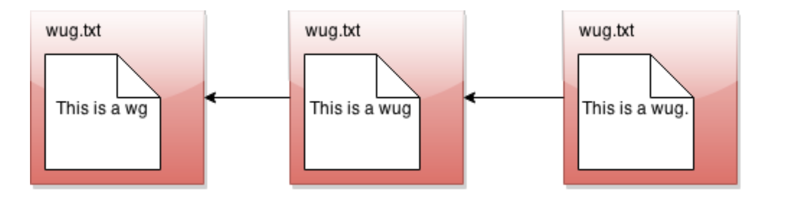
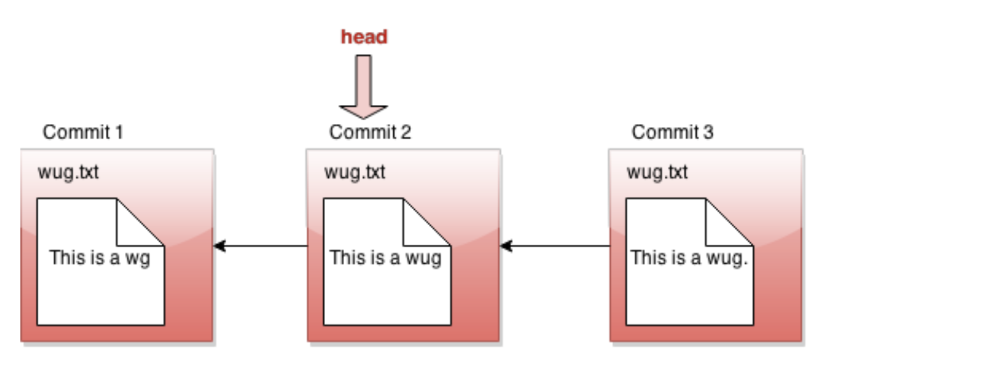
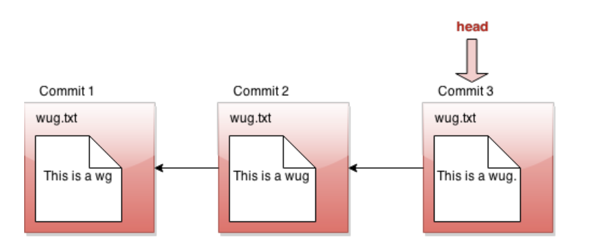
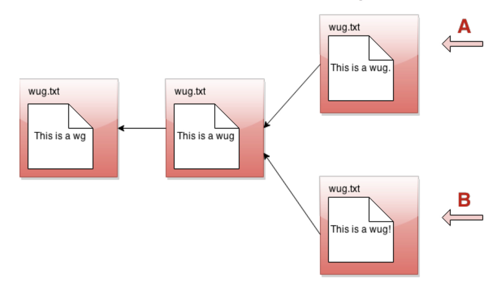
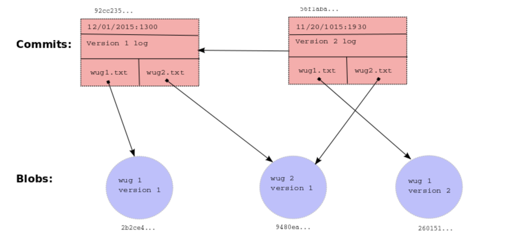

# Summary

This is a version control system is implemented from scratch and mimics the main functionality of the well-known Git, such as: 
  - Committing: saving the contents of entire directories of files, which are called commits. 
  - Checking out: restoring a version of one or more files or entire commits.  
  - Log: viewing the history of your backups.  
  - Branches: maintaining related sequences of commits. 
  - Merging changes made in one branch into another. 

Simple Visualization of Commits (snapshots of your files): 

Current Commits:

Revert last Commit:

Multiple Commits(Commit Tree):

Internal structures: 
  - Blobs: Essentially the contents of files. 
  - Trees: Directory structures mapping names to references to blobs and other trees (subdirectories). 
  - Commits: Combinations of log messages, other metadata (commit date, author, etc.), a reference to a tree, and references to parent commits. The repository also maintains a mapping from branch heads to references to commits, so that certain important commits have symbolic names. 
  

